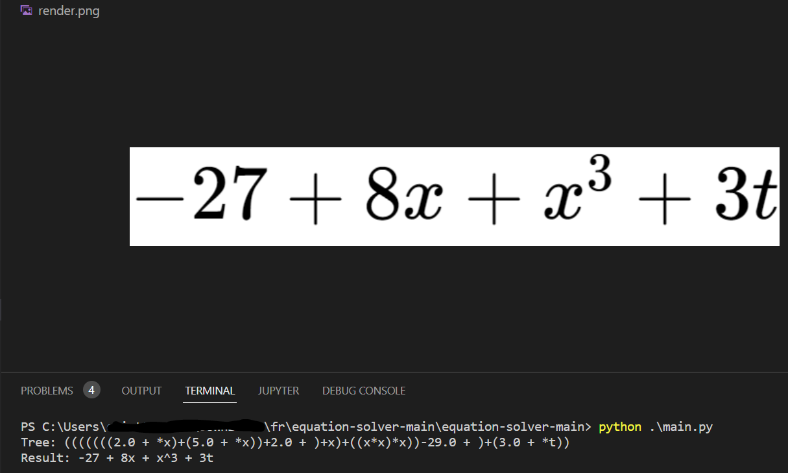
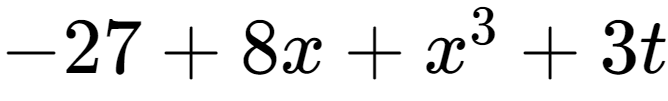

# Equation solver

Simple literal expression reduicer and rederer.

## Description

Work with addition, substraction and multiplication.
```
2x+5x +2+ x+xxx - 29 + 3t
Will return
-27 + 8x + x^3 + 3t```


## Getting Started

### Dependencies

```pip install -r requirements.txt```